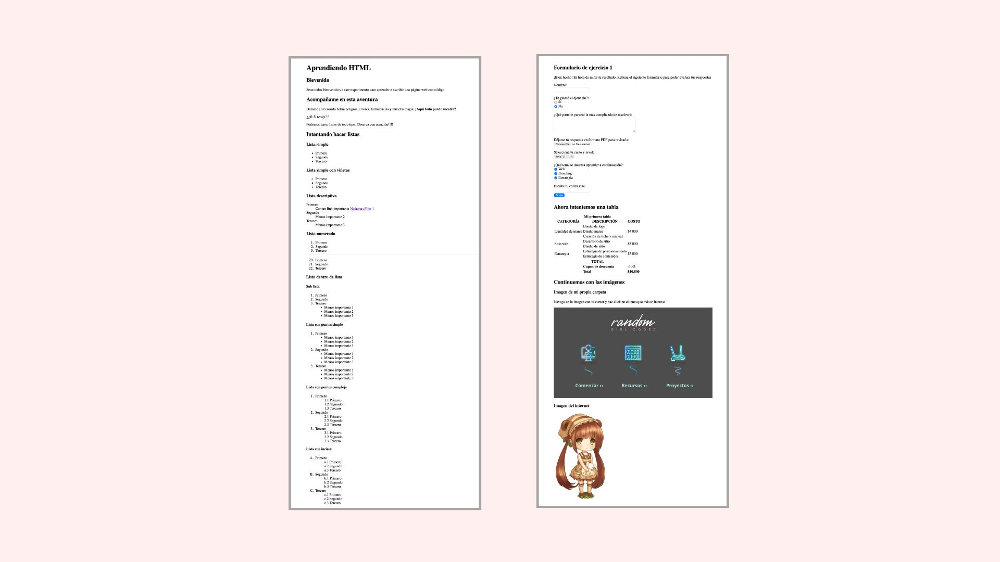
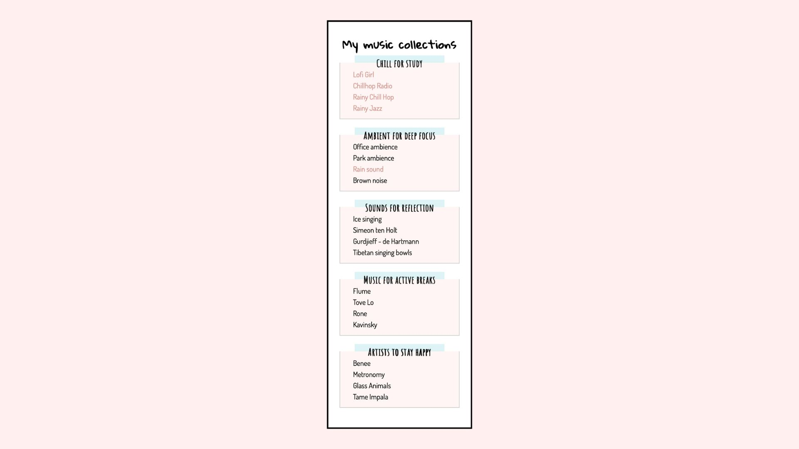

# HTML and CSS Learning

My first steps in programming began in 2022. I took my first HTML course with Google Activate and studied HTML and CSS with OpenClassrooms. I learned to use a text editor for the first time, choosing VS Code, though learning the full developer environment took longer.

I continued learning. In 2025, I uploaded these projects from a folder on my computer to GitHub. By then, I had learned to use the terminal and version control, which I used to manage my changes and document where I started.

Now in 2026, I'm revisiting this project to learn how to work with AI in the loop and include it as part of my development process.

## Introduction to Web Development: HTML-CSS on Google Activate

**Course content**

- History of the web
- How the web works
- How to write a web page
- How to publish a website
- How to write a proper web page

### See [HTML exercise](HTML_exercise.html), updated in 2025.

**Project content**

- Text tags and attributes
- List tags and attributes
- Form tags and attributes
- Table tags and attributes
- Images and image maps

**2025 updates**

- Added metadata to the document head.
- Created an image for the clickable areas.
- Fixed the clickable areas on the image.

**2026 updates**

- Improved the HTML structure, including the nested lists, table, image map, and form.
- Added clear form labels and grouped choices, corrected the course options, and configured the form for a file upload.
- Preserved the image’s proportions and adjusted its clickable areas. Corrected Spanish spelling and page metadata.

## Build Your First Web Pages With HTML and CSS

**Course content**

- Introduction to HTML and CSS
- Create HTML text elements, block and inline elements
- Structure an entire page with semantic HTML
- Apply CSS to HTML elements

### See [CSS exercise](My_music_collections/index.html), updated in 2025.

**Project content**

- Document outline
- Document structure
- Semantic HTML
- Lists and links

**2025 updates**

- Added metadata to the document head.
- Improved the semantic HTML.
- Updated the lists.
- Fixed broken links.

**2026 updates**

- Improved keyboard navigation in the music collection by applying the existing link styling to keyboard-focused links.
